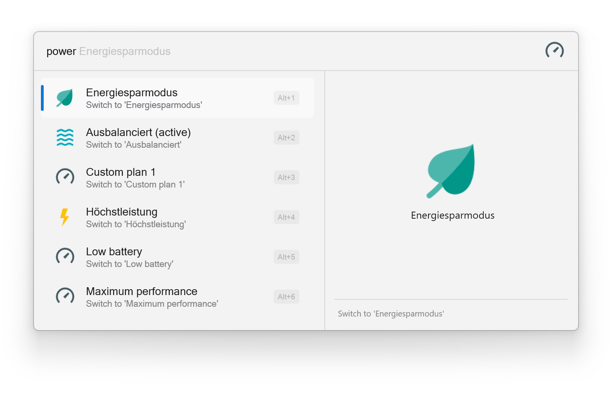

:toc: macro
:toclevels: 3
:icons: font
:source-highlighter: rouge

++++

    
    
    

++++

= Power Plan Switcher for FlowLauncher

A https://www.flowlauncher.com/[FlowLauncher] plugin to easily activate power plans.

toc::[]
:toclevels: 3

== Installation

=== Install via FlowLauncher

. Open FlowLauncher
. Type `pm install Power Plans`
. Press Enter to install the plugin
. Restart FlowLauncher if prompted

=== Manual Installation

. Download the latest release from the https://github.com/TillKnollmann/Flow.Launcher.Plugin.PowerPlans/releases[GitHub Releases page]
. Extract the ZIP file to your FlowLauncher plugins directory:
+
[source]
----
%APPDATA%\FlowLauncher\Plugins\Power Plans-{version}
----
. Restart FlowLauncher

== Usage

Type `power <search-term>` and see a list of available power plans.
Select a result to activate the plan.

> **_NOTE:_** Due to initial detection of the default power plans in the system's locale, the first search might take a few seconds. Thereafter, the search should be near instantaneous.

[.center.text-center]

== Attributions

This plugin makes use of the following resources:

* *https://icons8.com[Icons8]*: Icons used in the plugin interface

== Lenovo Legion Power LED Support

This plugin includes experimental support for controlling the power LED on Lenovo Legion laptops.

For detailed information on enabling and configuring this feature, see link:LENOVO_LEGION_LED.md[LENOVO_LEGION_LED.md].

*Quick Summary:*

* Disabled by default
* Only works on Lenovo Legion laptops
* Requires `wmi` Python package: `pip install wmi pywin32`
* Enable by setting `lenovo_legion_led_enabled: true` in `.cache/settings.json`

== Support

For issues, feature requests, or questions, open an issue on https://github.com/TillKnollmann/Flow.Launcher.Plugin.PowerPlans/issues[GitHub Issues].

== License

This project is licensed under the GNU General Public License v3.0 (GPL-3.0).

For more information about the GPL-3.0 license, visit: https://www.gnu.org/licenses/gpl-3.0.html

== Links

* *FlowLauncher*: https://www.flowlauncher.com/

---

Made with ❤️ for the FlowLauncher community