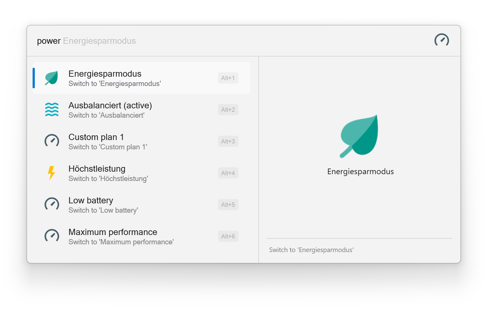

# Power Plan Switcher for Flow Launcher

A [FlowLauncher](https://www.flowlauncher.com/) plugin to easily activate power plans.

## Installation

You can install this plugin via `pm install Power Plans`

## Usage

Type `power <search-term>` and see a list of available power plans.
Select a result to activate the plan.

> **_NOTE:_** Due to initial detection of the default power plans in the system's locale, the first search might take a few seconds. Thereafter, the search should be near instantaneous.

## Attribution

All icons are from <https://icons8.com/icons>.
